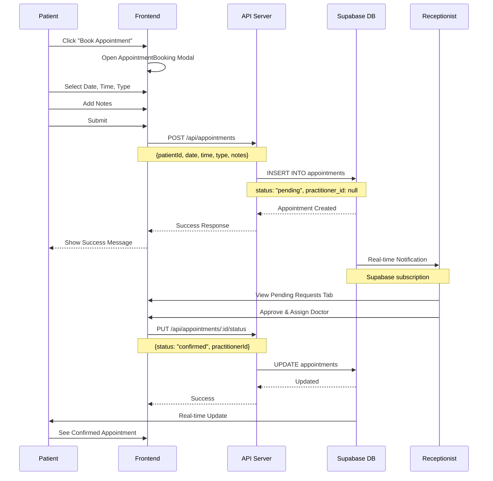
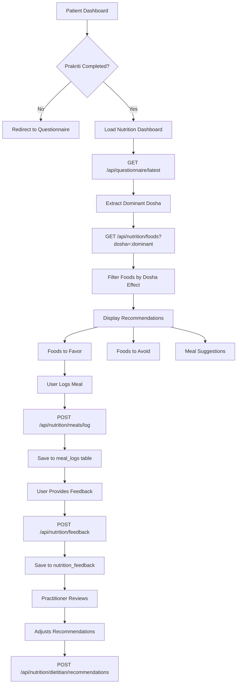
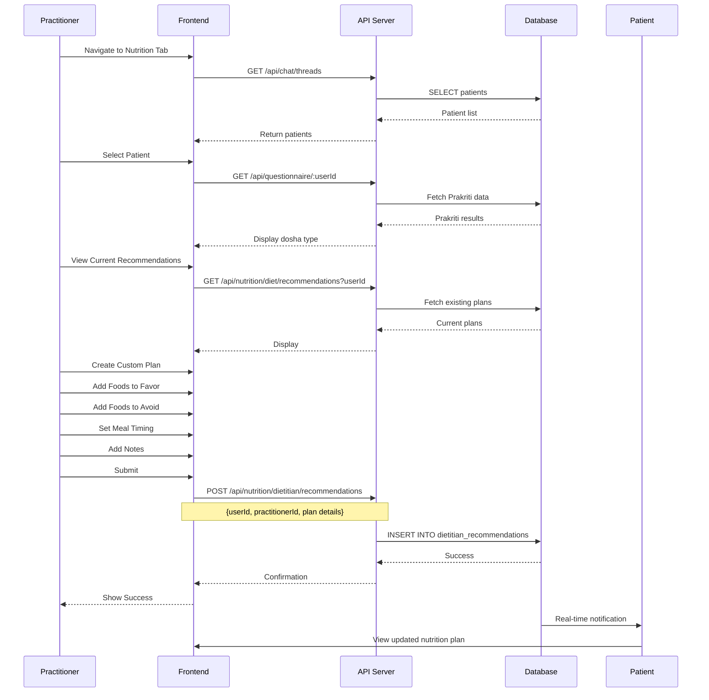
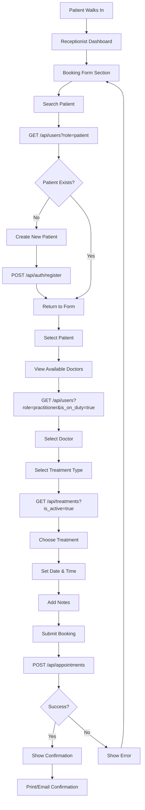

# AyurTribe - Advanced Workflow Structure & Route Connections

**Generated:** December 11, 2025  
**Purpose:** Complete workflow diagrams with route connections for all user journeys

---

## 📑 Table of Contents
1. [Patient Journey Workflows](#patient-journey-workflows)
2. [Practitioner Workflows](#practitioner-workflows)
3. [Receptionist Workflows](#receptionist-workflows)
4. [Admin Workflows](#admin-workflows)
5. [Route Connection Map](#route-connection-map)
6. [API Integration Flows](#api-integration-flows)

---

## 🔵 PATIENT JOURNEY WORKFLOWS

### Workflow 1: New Patient Onboarding

```mermaid
graph TD
    A[Visit Website] --> B[/auth/login]
    B --> C{Has Account?}
    C -->|No| D[/auth/register]
    C -->|Yes| E[Login Form]
    
    D --> F[Fill Registration Form]
    F --> G[POST /api/auth/register]
    G --> H{Success?}
    H -->|Yes| I[Auto Login]
    H -->|No| J[Show Error]
    J --> F
    
    E --> K[Enter Credentials]
    K --> L[POST /api/auth/login]
    L --> M{Valid?}
    M -->|Yes| I
    M -->|No| N[Show Error]
    N --> E
    
    I --> O[/auth/prakriti-questionnaire]
    O --> P[Complete 40 Questions]
    P --> Q[POST /api/questionnaire/submit]
    Q --> R[POST /predict ML Service]
    R --> S[Save Results to DB]
    S --> T[/patient/dashboard]
```

**Route Connections:**
- `/` → `/auth/login` (Landing redirect)
- `/auth/login` → `/auth/register` (New user)
- `/auth/register` → `/auth/prakriti-questionnaire` (After registration)
- `/auth/prakriti-questionnaire` → `/patient/dashboard` (After completion)

**API Calls:**
1. `POST /api/auth/register` → Creates user in Supabase
2. `POST /api/auth/login` → Returns JWT token
3. `POST /api/questionnaire/submit` → Calls ML service + saves results
4. `POST http://localhost:8000/predict` → ML prediction

---

### Workflow 2: Patient Dashboard Navigation

```mermaid
graph LR
    A[/patient/dashboard] --> B[View Prakriti Results]
    A --> C[Nutrition Dashboard]
    A --> D[Book Appointment]
    A --> E[View Appointments]
    A --> F[Chat with Doctor]
    A --> G[Profile Settings]
    
    B --> B1[GET /api/questionnaire/latest]
    C --> C1[GET /api/nutrition/foods]
    C --> C2[GET /api/nutrition/diet/recommendations]
    D --> D1[/patient/appointments/new]
    E --> E1[GET /api/appointments/user/:email]
    F --> F1[WebSocket /ws]
    G --> G1[Profile Manager Modal]
```

**Component Hierarchy:**
```
PatientDashboard
├── PrakritiSummaryCard
│   └── GET /api/questionnaire/latest
├── PrakritiVisualizationEnhanced
│   └── Displays scores from state
├── NutritionDashboard
│   ├── GET /api/nutrition/foods
│   ├── GET /api/nutrition/diet/recommendations
│   ├── POST /api/nutrition/meals/log
│   └── POST /api/nutrition/feedback
├── AppointmentBooking (Modal)
│   └── POST /api/appointments
├── ChatWidget
│   ├── GET /api/chat/threads
│   ├── POST /api/chat/messages
│   └── WebSocket connection
└── ProfileManager (Modal)
    └── PUT /api/users/:id
```

---

### Workflow 3: Appointment Booking Flow



**Routes:**
- Patient: `/patient/dashboard` → `AppointmentBooking` component
- Receptionist: `/receptionist/dashboard` → Pending tab
- API: `POST /api/appointments`, `PUT /api/appointments/:id/status`

---

### Workflow 4: Nutrition Recommendation Flow



**Data Flow:**
1. `questionnaire_answers.dominant` → Determines dosha type
2. `food_items.dosha_effect` → Filtered by dominant dosha
3. `meal_logs` → Tracks patient adherence
4. `nutrition_feedback` → Continuous improvement
5. `dietitian_recommendations` → Practitioner customization

---

## 🟢 PRACTITIONER WORKFLOWS

### Workflow 5: Practitioner Daily Routine

```mermaid
graph TD
    A[Login] --> B[/practitioner/dashboard]
    B --> C[Toggle On Duty]
    C --> D[POST /api/users/:id - Update is_on_duty]
    
    B --> E[View Today's Appointments]
    E --> F[GET /api/appointments?practitionerId&date=today]
    
    B --> G[Check Unread Messages]
    G --> H[GET /api/chat/threads]
    H --> I{Unread Count > 0?}
    I -->|Yes| J[Open Chat Thread]
    I -->|No| K[Continue]
    
    J --> L[WebSocket Connection]
    L --> M[Real-time Chat]
    
    B --> N[Review Pending Questionnaires]
    N --> O[GET /api/questionnaire?requires_review=true]
    O --> P[Validate ML Predictions]
    P --> Q[PUT /api/questionnaire/:id]
    Q --> R[Update practitioner_validated=true]
    
    B --> S[Nutrition Management Tab]
    S --> T[Select Patient]
    T --> U[GET /api/nutrition/dietitian/recommendations?userId]
    U --> V[Create/Update Diet Plan]
    V --> W[POST /api/nutrition/dietitian/recommendations]
```

**Key Routes:**
- `/practitioner/dashboard` → Main hub
- `/practitioner/nutrition` → Nutrition management
- `/practitioner/patients` → Patient list
- `/practitioner/questionnaires/review` → Validation queue

---

### Workflow 6: Patient Nutrition Plan Creation



---

## 🟡 RECEPTIONIST WORKFLOWS

### Workflow 7: Appointment Management

```mermaid
graph TD
    A[/receptionist/dashboard] --> B{Select Tab}
    
    B -->|Pending| C[View Pending Requests]
    C --> D[GET /api/appointments?status=pending]
    D --> E{Action}
    E -->|Approve| F[PUT /api/appointments/:id]
    E -->|Reject| G[PUT /api/appointments/:id]
    F --> H[Update status=confirmed]
    G --> I[Update status=cancelled]
    
    B -->|Confirmed| J[View Confirmed Appointments]
    J --> K[GET /api/appointments?status=confirmed]
    K --> L{Action}
    L -->|Assign Doctor| M[Select Practitioner]
    M --> N[PUT /api/appointments/:id]
    N --> O[Update practitioner_id]
    L -->|Mark Complete| P[PUT /api/appointments/:id]
    P --> Q[Update status=completed]
    L -->|Mark No-Show| R[PUT /api/appointments/:id]
    R --> S[Update status=no-show]
    
    B -->|History| T[View Past Appointments]
    T --> U[GET /api/appointments?status=completed,cancelled,no-show]
```

---

### Workflow 8: Walk-in Appointment Booking



**Form Fields:**
- Patient Selection (dropdown with search)
- Practitioner Selection (filtered by on_duty)
- Treatment Type (from treatments table)
- Date (date picker, min: today)
- Time (time picker)
- Notes (textarea, optional)

---

## 🔴 ADMIN WORKFLOWS

### Workflow 9: Staff Management

```mermaid
graph TD
    A[/admin/dashboard] --> B[Navigate to Staff Tab]
    B --> C[/admin/staff]
    
    C --> D[Click Create Staff]
    D --> E[Open Staff Form Modal]
    
    E --> F[Fill Form]
    F --> G[Email]
    F --> H[Password]
    F --> I[First Name]
    F --> J[Last Name]
    F --> K[Role Selection]
    
    K --> L{Role Type}
    L -->|Practitioner| M[Set role=practitioner]
    L -->|Receptionist| N[Set role=receptionist]
    L -->|Admin| O[Set role=admin]
    
    M --> P[Submit Form]
    N --> P
    O --> P
    
    P --> Q[POST /api/admin/create-staff]
    Q --> R[Supabase Admin API]
    R --> S[Create Auth User]
    S --> T[Auto-confirm Email]
    T --> U[Create Public User Record]
    U --> V{Success?}
    
    V -->|Yes| W[Show Success Message]
    V -->|No| X[Show Error]
    X --> E
    
    W --> Y[Refresh Staff List]
    Y --> Z[GET /api/users?role=practitioner,receptionist,admin]
```

**API Endpoint Details:**
```typescript
POST /api/admin/create-staff
Headers: {
  Authorization: Bearer <admin-jwt-token>
}
Body: {
  email: string,
  password: string,
  firstName: string,
  lastName: string,
  role: 'practitioner' | 'receptionist' | 'admin'
}
Response: {
  message: string,
  user: {
    id: uuid,
    email: string,
    role: string
  }
}
```

---

## 🗺️ ROUTE CONNECTION MAP

### Frontend Routes (React Router)

```
/ (Root)
├── /auth
│   ├── /login                    → Login page
│   ├── /register                 → Registration page
│   └── /prakriti-questionnaire   → Questionnaire page
│
├── /patient (Protected: role=patient)
│   ├── /dashboard                → Patient main dashboard
│   └── /appointments
│       └── /new                  → Appointment booking
│
├── /practitioner (Protected: role=practitioner)
│   ├── /dashboard                → Practitioner main dashboard
│   ├── /nutrition                → Nutrition management
│   ├── /patients                 → Patient list
│   ├── /prescriptions/new        → Create prescription
│   ├── /questionnaires/review    → Review queue
│   ├── /reports                  → Generate reports
│   └── /availability             → Set availability
│
├── /receptionist (Protected: role=receptionist)
│   └── /dashboard                → Receptionist main dashboard
│
└── /admin (Protected: role=admin)
    ├── /dashboard                → Admin main dashboard
    ├── /staff                    → Staff management
    ├── /patients                 → Patient management
    ├── /treatments               → Treatment management
    └── /reports                  → Analytics & reports
```

### Backend API Routes

```
/api
├── /auth
│   ├── POST   /register          → Create new user
│   ├── POST   /login             → Authenticate user
│   ├── POST   /logout            → End session
│   ├── GET    /me                → Get current user
│   ├── POST   /send-otp          → Send OTP (legacy)
│   └── POST   /verify-otp        → Verify OTP (legacy)
│
├── /questionnaire (Protected)
│   ├── POST   /submit            → Submit questionnaire
│   ├── GET    /latest            → Get latest results
│   ├── GET    /me                → Get user's questionnaire
│   ├── GET    /status            → Check completion
│   ├── GET    /:userId           → Get specific user's data
│   └── DELETE /:id               → Delete questionnaire
│
├── /nutrition (Protected)
│   ├── /foods
│   │   ├── GET    /              → Get all foods
│   │   ├── GET    /:id           → Get specific food
│   │   └── GET    /dosha/:dosha  → Get foods by dosha
│   ├── /diet
│   │   ├── POST   /generate      → AI-generate diet plan
│   │   ├── POST   /recommendations → Save recommendation
│   │   └── GET    /recommendations → Get recommendations
│   ├── /meals
│   │   ├── POST   /log           → Log a meal
│   │   └── GET    /logs          → Get meal logs
│   ├── POST   /feedback          → Submit feedback
│   └── /dietitian
│       ├── POST   /recommendations → Practitioner creates plan
│       └── GET    /recommendations → Get practitioner plans
│
├── /chat (Protected)
│   ├── GET    /threads           → Get user's threads
│   ├── POST   /threads           → Create new thread
│   ├── POST   /messages          → Send message
│   └── GET    /messages/:threadId → Get thread messages
│
├── /appointments (Protected)
│   ├── POST   /                  → Book appointment
│   ├── GET    /user/:userEmail   → Get user's appointments
│   └── PUT    /:id/status        → Update status
│
└── /admin (Protected: role=admin)
    └── POST   /create-staff      → Create staff account
```

### ML Service Routes

```
http://localhost:8000
├── GET    /health                → Health check
├── POST   /predict               → Prakriti prediction
└── GET    /docs                  → API documentation (FastAPI auto-generated)
```

### WebSocket Events

```
ws://localhost:4000/ws
├── Client → Server
│   ├── chat-message              → Send message
│   └── typing                    → Typing indicator
│
└── Server → Client
    ├── chat-message              → Receive message
    └── typing                    → Receive typing indicator
```

---

## 🔄 API INTEGRATION FLOWS

### Integration 1: Prakriti Assessment Complete Flow

```
Frontend                    API Server              ML Service              Database
   │                            │                       │                      │
   │ POST /questionnaire/submit │                       │                      │
   ├───────────────────────────>│                       │                      │
   │                            │                       │                      │
   │                            │ Calculate Traditional │                      │
   │                            │ Scores (vata/pitta/   │                      │
   │                            │ kapha)                │                      │
   │                            │                       │                      │
   │                            │ POST /predict         │                      │
   │                            ├──────────────────────>│                      │
   │                            │                       │                      │
   │                            │                       │ Feature Engineering  │
   │                            │                       │ Model Inference      │
   │                            │                       │ Calculate Confidence │
   │                            │                       │                      │
   │                            │ ML Prediction Response│                      │
   │                            │<──────────────────────┤                      │
   │                            │                       │                      │
   │                            │ Merge Traditional +   │                      │
   │                            │ ML Predictions        │                      │
   │                            │                       │                      │
   │                            │ INSERT questionnaire_answers                 │
   │                            ├─────────────────────────────────────────────>│
   │                            │                       │                      │
   │                            │                       │              Save Complete
   │                            │                       │              Assessment
   │                            │                       │                      │
   │                            │ Generate Diet Recommendations                │
   │                            ├─────────────────────────────────────────────>│
   │                            │                       │                      │
   │                            │                       │              Query food_items
   │                            │                       │              by dosha_effect
   │                            │                       │                      │
   │                            │                       │              INSERT diet_
   │                            │                       │              recommendations
   │                            │                       │                      │
   │ Success Response           │                       │                      │
   │<───────────────────────────┤                       │                      │
   │                            │                       │                      │
   │ Navigate to Dashboard      │                       │                      │
   │ Display Results            │                       │                      │
   │                            │                       │                      │
```

### Integration 2: Real-time Chat Flow

```
Patient Client          WebSocket Server         Database            Practitioner Client
      │                       │                      │                       │
      │ Connect to /ws        │                      │                       │
      ├──────────────────────>│                      │                       │
      │                       │                      │ Connect to /ws        │
      │                       │<─────────────────────┼───────────────────────┤
      │                       │                      │                       │
      │ emit('chat-message')  │                      │                       │
      ├──────────────────────>│                      │                       │
      │                       │                      │                       │
      │                       │ INSERT chat_messages │                       │
      │                       ├─────────────────────>│                       │
      │                       │                      │                       │
      │                       │ Broadcast to thread  │                       │
      │                       ├──────────────────────┼──────────────────────>│
      │                       │                      │                       │
      │                       │                      │ emit('chat-message')  │
      │                       │                      │                       │
      │                       │ UPDATE is_read=false │                       │
      │                       ├─────────────────────>│                       │
      │                       │                      │                       │
```

---

## 📊 State Management Flow

### Patient Dashboard State

```typescript
// Initial State
{
  user: null,
  prakritiScores: null,
  mentalHealth: null,
  appointments: [],
  healthMetrics: [],
  loading: true,
  activeView: 'dashboard'
}

// After Login
useEffect(() => {
  1. Check Supabase session
  2. Load user from localStorage fallback
  3. Call loadDashboardData(userId)
})

// loadDashboardData Flow
async loadDashboardData(userId) {
  1. GET user profile → setUser()
  2. GET questionnaire_answers → setPrakritiScores()
  3. GET appointments → setAppointments()
  4. GET health_metrics → setHealthMetrics()
  5. setLoading(false)
}

// Real-time Updates
useEffect(() => {
  // Subscribe to questionnaire changes
  supabase
    .channel('questionnaire-changes')
    .on('INSERT', fetchPrakritiData)
    .subscribe()
})
```

---

## 🎯 Complete User Journey Examples

### Example 1: First-time Patient Complete Journey

```
1. Visit http://localhost:3000
   ↓
2. Redirect to /auth/login
   ↓
3. Click "Register" → /auth/register
   ↓
4. Fill form: email, password, name, phone
   ↓
5. POST /api/auth/register
   ↓
6. Auto-login with JWT token
   ↓
7. Redirect to /auth/prakriti-questionnaire
   ↓
8. Answer 40 questions (sliders 0-1)
   ↓
9. POST /api/questionnaire/submit
   ↓
10. Backend calls POST http://localhost:8000/predict
    ↓
11. ML returns prediction + confidence
    ↓
12. Save to questionnaire_answers table
    ↓
13. Generate diet recommendations
    ↓
14. Redirect to /patient/dashboard
    ↓
15. Display:
    - Prakriti visualization (Vata 25%, Pitta 35%, Kapha 40%)
    - ML confidence: 87%
    - Nutrition recommendations
    - Book appointment button
```

### Example 2: Practitioner Reviews Patient

```
1. Login → /practitioner/dashboard
   ↓
2. Toggle "On Duty" → PUT /api/users/:id {is_on_duty: true}
   ↓
3. Click "Review Questionnaires"
   ↓
4. GET /api/questionnaire?requires_review=true
   ↓
5. View patient's Prakriti results
   ↓
6. Review ML prediction vs traditional
   ↓
7. Add practitioner notes
   ↓
8. PUT /api/questionnaire/:id {practitioner_validated: true}
   ↓
9. Navigate to Nutrition Tab
   ↓
10. Select patient from dropdown
    ↓
11. View current recommendations
    ↓
12. Create custom diet plan
    ↓
13. POST /api/nutrition/dietitian/recommendations
    ↓
14. Patient receives real-time notification
```

---

## 🔐 Authentication Flow Diagram

```
┌──────────────┐
│ User Visits  │
│   Website    │
└──────┬───────┘
       │
       ▼
┌──────────────────┐
│ Check localStorage│
│ for 'token'      │
└──────┬───────────┘
       │
       ├─── Token Exists ───┐
       │                    │
       │                    ▼
       │            ┌───────────────┐
       │            │ Validate with │
       │            │   Supabase    │
       │            └───────┬───────┘
       │                    │
       │                    ├─── Valid ───┐
       │                    │             │
       │                    │             ▼
       │                    │     ┌──────────────┐
       │                    │     │ Get user.role│
       │                    │     └──────┬───────┘
       │                    │            │
       │                    │            ├─ patient → /patient/dashboard
       │                    │            ├─ practitioner → /practitioner/dashboard
       │                    │            ├─ receptionist → /receptionist/dashboard
       │                    │            └─ admin → /admin/dashboard
       │                    │
       │                    └─── Invalid ───┐
       │                                    │
       └─── No Token ─────────────────────┬─┘
                                          │
                                          ▼
                                  ┌──────────────┐
                                  │ Redirect to  │
                                  │ /auth/login  │
                                  └──────────────┘
```

---

## 📱 Component-Route-API Mapping

| Component | Route | Primary APIs | WebSocket |
|-----------|-------|--------------|-----------|
| **Login** | `/auth/login` | `POST /api/auth/login` | ❌ |
| **Register** | `/auth/register` | `POST /api/auth/register` | ❌ |
| **PrakritiQuestionnaire** | `/auth/prakriti-questionnaire` | `POST /api/questionnaire/submit`<br>`POST /predict` (ML) | ❌ |
| **PatientDashboard** | `/patient/dashboard` | `GET /api/questionnaire/latest`<br>`GET /api/appointments/user/:email`<br>`GET /api/nutrition/diet/recommendations` | ✅ |
| **NutritionDashboard** | (Component in Patient Dashboard) | `GET /api/nutrition/foods`<br>`POST /api/nutrition/meals/log`<br>`POST /api/nutrition/feedback` | ❌ |
| **AppointmentBooking** | (Modal in Patient Dashboard) | `POST /api/appointments` | ❌ |
| **ChatWidget** | (Component in all dashboards) | `GET /api/chat/threads`<br>`POST /api/chat/messages` | ✅ |
| **PractitionerDashboard** | `/practitioner/dashboard` | `GET /api/chat/threads`<br>`GET /api/appointments`<br>`GET /api/questionnaire` | ✅ |
| **NutritionManagement** | `/practitioner/nutrition` | `GET /api/nutrition/dietitian/recommendations`<br>`POST /api/nutrition/dietitian/recommendations` | ❌ |
| **ReceptionistDashboard** | `/receptionist/dashboard` | `GET /api/appointments`<br>`PUT /api/appointments/:id/status`<br>`POST /api/appointments` | ❌ |
| **AdminDashboard** | `/admin/dashboard` | `GET /admin/metrics` | ❌ |
| **StaffManagement** | `/admin/staff` | `POST /api/admin/create-staff`<br>`GET /api/users` | ❌ |

---

## 🚀 Quick Reference: Common Workflows

### Quick Ref 1: Book Appointment (Patient)
```
Route: /patient/dashboard
Action: Click "Book Appointment"
API: POST /api/appointments
Data: {patientId, date, time, type, notes}
Result: status="pending", awaits receptionist approval
```

### Quick Ref 2: Approve Appointment (Receptionist)
```
Route: /receptionist/dashboard → Pending tab
Action: Click "Approve"
API: PUT /api/appointments/:id
Data: {status: "confirmed", practitionerId}
Result: Patient notified, appointment confirmed
```

### Quick Ref 3: Create Diet Plan (Practitioner)
```
Route: /practitioner/nutrition
Action: Select patient → Create plan → Submit
API: POST /api/nutrition/dietitian/recommendations
Data: {userId, practitionerId, foods_to_favor, foods_to_avoid, meal_timing}
Result: Patient sees updated nutrition dashboard
```

### Quick Ref 4: Create Staff (Admin)
```
Route: /admin/staff
Action: Click "Create Staff" → Fill form → Submit
API: POST /api/admin/create-staff
Data: {email, password, firstName, lastName, role}
Result: New staff account created with auto-confirmed email
```

---

**End of Advanced Workflow Structure**

This document provides complete route connections, API integrations, and workflow diagrams for all user journeys in the AyurTribe platform.
